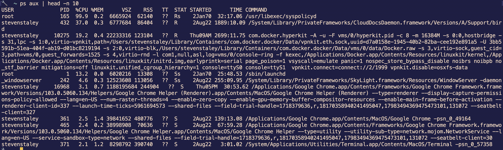

# Lesson 1 - Software Engineering Basics

## Purpose

The purpose of this lesson is to discuss and understand what a software engineer does and the basic tools necessary.


## Intro

Before we can start talking about *how* to be a software engineer, we need to talk about what it means to be a software engineer. I think it would help to define a software engineer in terms of what they create. If you were to talk about what a cobbler does, you would talk about making shoes. If you were to define an author, you might say someone who writes books. But for some reason, when discussing what a software engineer does, many people would intially say: "A software engineer writes code". But that would be like saying "an author writes words". It doesn't take into consideration the main output a software engineer produces

So with that in mind, let's try to come up with a definition:

"A software engineer writes and manages programs that run on as processes on computers as well as communication among them and the communication with humans that interact with them."

You might also say that a software engineer *writes software*. But that's a little vague. "Software" doesn't truly describe what it is that a software engineer has to create & maintain. 

## So what *is* a process?

A process is the basic unit of an operating system. Everything runs as a process. One way to list all the processes running on your computer is with the command shown below: `ps aux`.

So what does a process on a machine look like? It looks like this:



This is a list of the processes running on my machine. As you might be able to see if you look closely, one is the terminal I'm typing in, and three are chrome tabs (yes, even tabs in your browser are processes on a computer). It's important to keep this in context as you learn how to write software. *This* is the the context of your work. Your end goal isn't a class or an object. It's a system that runs on and interacts with a computer. Not understanding the what your software runs on is like building an engine without understanding the car that will use it to drive.

(Note: This *is* less relevant to Frontend engineers for whom the process is far abstracted from the code they write. There's also Kernel which isn't in itself a process, but semantics.)

At this point I'd like to talk about how processes work, but first you'll need to understand a bit more about how to interact with a computer.

## Interacting With a Computer/OS

Considering that the processes you'll be writing will be running on a computer, it's important to understand how to navigate and interact with one. Obviously you've used a screen, a mouse before, but as a software engineer you'll spend a lot of time inside of the computers where your code is running, whether that's your machine while developing, or the machines your code is running on in the real world, or "production".

The "shell" is the term used to describe the interface you use to interact with the computer. Most of the time this just means navigating the file system and running programs.One of the most common ones is "bash". 

If you're on a Mac, you can spin up a shell by openning the "Terminal" app on your computer. 

 While there are many different shells, they generally all support the same general commands. The ones you'll be using most are:
```
ls # This lists 
rm
rm -rf
mkdir
cp
mv
```